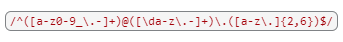

# Regex Tutorial for Email
To match email addresses, we can use a regular expression (regex) that consists of three parts: the local part, the domain part, and the top-level domain (TLD) part. The local part can have alphanumeric characters, periods, underscores, hyphens, and plus signs. It cannot start or end with a period and cannot have consecutive periods. The domain part can have alphanumeric characters and hyphens, separated by periods. The TLD part represents the top-level domain and consists of two to six alphabetic characters. By combining these patterns, we can create a regex to validate email addresses:

## Summary

Briefly summarize the regex you will be describing and what you will explain. Include a code snippet of the regex. Replace this text with your summary.

## Table of Contents

- [Anchors](#anchors)
- [Quantifiers](#quantifiers)
- [Character Classes](#character-classes)
- [Grouping and Capturing](#grouping-and-capturing)
- [Bracket Expressions](#bracket-expressions)
- [Greedy and Lazy Match](#greedy-and-lazy-match)

## Regex Components

### Anchors
The anchors used in the regex expression for matching emails are (^), which declares the beginning of the string and ($), which declares the end of the string.

### Quantifiers
The quantifiers in this expression are (+) and ({2,6}). The (+) connects the users email name, the email service, and the (.com). And ({2,6}) restricts the match range of the string to be between 2 and 6 characters long from the set of case sensitive letters(a-z).

### Character Classes
The character class in this expression, (\d), means that a single character matches a digit between 0-9.

### Grouping and Capturing
Referring to the example: /^([a-z0-9_\.-]+)@([\da-z\.-]+)\.([a-z\.]{2,6})$/, capturing group #1, ([a-z0-9_\.-]+), matches the user email name. Capturing group #2, ([\da-z\.-]+),matches the email service. And capturing group #3 is ([a-z\.]{2,6}) which matches the .com.

### Bracket Expressions
Bracket expressions for email validation include the character sets of ([a-z0-9_\.-]), which matches any case sensitive letter between (a-z), as well as a digit between 0-9 and matches the characters "_" , "-" , and ".". ([\da-z\.-]), which is matching a single digit from 0-9, any character a-z (case senstive), and the characters "." and "-".; ([a-z\.]) matches any character case senstive to (a-z) and the character ".".

### Greedy and Lazy Match
Because the expression includes the (+) and ({}) Quantifiers, it will match as many times as possible.

## Author
https://github.com/YaslinskiyM

