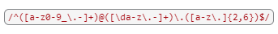

# Regex Turtorial for Email

## Description
This is a tutorial that explains how a specific regular expression, or regex, functions by breaking down each part of the expression and describing what it does. I'll explain how to use a regex to match emails, using the expressions 

## Table of Contents

- [UserStory](#UserStory)
- [AcceptanceCriteria](#AcceptanceCriteria)
- [Credits](#credits)
- [License](#license)
- [Contact](#Contact)

## UserStory
AS A web development student
I WANT a tutorial explaining a specific regex
SO THAT I can understand the search pattern the regex defines

## Acceptance Criteria
GIVEN a regex tutorial
WHEN I open the tutorial
THEN I see a descriptive title and introductory paragraph explaining the purpose of the tutorial, a summary describing the regex featured in the tutorial, a table of contents linking to different sections that break down each component of the regex and explain what it does, and a section about the author with a link to the author’s GitHub profile
WHEN I click on the links in the table of contents
THEN I am taken to the corresponding sections of the tutorial
WHEN I read through each section of the tutorial
THEN I find a detailed explanation of what a specific component of the regex does
WHEN I reach the end of the tutorial
THEN I find a section about the author and a link to the author’s GitHub profile

## Credits
Credit to my tutor. She has been helpful in helping me understand many of the complex topics. My instructor for teaching it to us and Google/Stackoverflow when I got errors I was able to troubleshoot.
## License
 [https://choosealicense.com/](https://choosealicense.com/).
${renderLicenseLink (data.license)} 
🏆 The previous sections are the bare minimum, and your project will ultimately determine the content of this document. You might also want to consider adding the following sections.
## Badges
${renderLicenseBadge (data.license)}

## Contact
YaslinskiyM Github